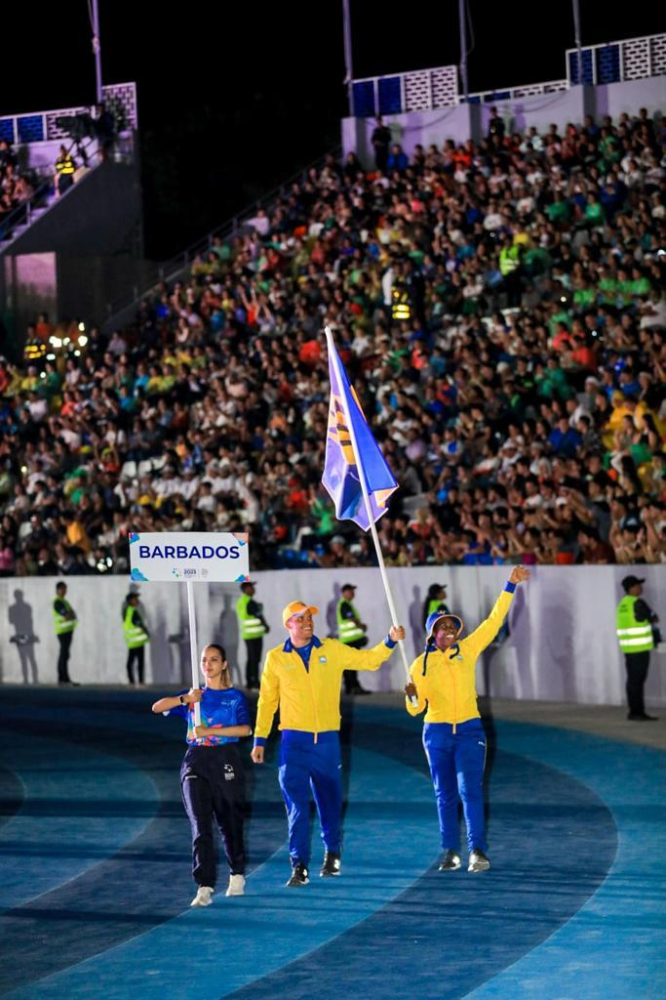
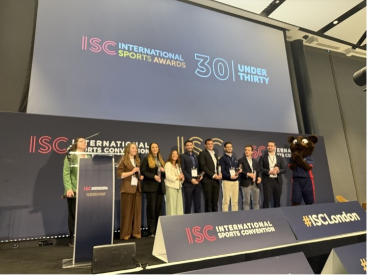
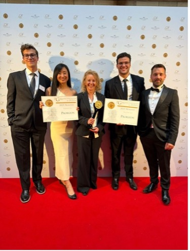

# Hi, I'm Luis 👋

**Applied AI & Backend Engineer building production AI systems.**

I work across agentic AI, LLM systems, retrieval/evaluation, machine learning,
backend engineering and cloud infrastructure.

🏊 National Record Holder & World Championships swimmer  
🏆 International Sports Convention 30 Under 30  
📍 London, UK

  

## About me

I'm an Applied AI and Backend Engineer focused on turning AI/ML capabilities
into reliable production systems.

My work spans LLM applications — including RAG, agents and context engineering —
machine-learning pipelines, APIs and cloud infrastructure.

I've worked primarily in early-stage startups, where I've owned several systems from
initial experimentation through backend architecture and production deployment.

I've had the privilege of wearing many hats at small startups and, as a result,
have gained experience across a wide range of the technology stack. I've even
built front ends for mobile applications and deployed them through TestFlight.

One of my strengths is that I'm comfortable putting myself in unfamiliar situations
and learning quickly. There is a strong parallel with my swimming career, where
I've had to coach myself for much of my professional career.

> **Note:** Much of my production engineering work lives in private company
> repositories because of commercial and IP restrictions.

## What I build

🤖 **Applied AI systems** — agents, tool use, structured outputs and LLM workflows

🔎 **Retrieval systems** — RAG, embeddings, hybrid retrieval, reranking and evaluation

🧠 **Machine learning systems** — training pipelines, feature engineering,
evaluation and deployment

⚙️ **Backend systems** — Python/TypeScript APIs, databases, asynchronous
workflows and data pipelines

☁️ **Production infrastructure** — AWS, GCP, Docker, SageMaker and Cloud Run

## Specific Domain Experience

⚽️ **Sports**  
⚕️ **Health**  
🚛 **Logistics**  
🏦 **Finance and Economics**

## Beyond engineering 🏊

I'm also an international competitive swimmer and national record holder for Barbados.

I've competed at the World Championships, Commonwealth Games, NCAA level and
regional international championships.

High-performance sport has strongly influenced how I approach engineering:
**attention to detail, curiosity, ownership and perseverance.**

## Highlights and Awards 🏆

### International Sports Convention 30 Under 30
Recognised for contributions to sports technology.

  
  

## Let's connect

I'm based in London and interested in Applied AI, AI Engineering,
ML Engineering and Backend Engineering opportunities.

[LinkedIn](https://www.linkedin.com/in/luissebastianweekes/) · [Email](mailto:luis.sebastian.weekes.d8a@gmail.com)

<!--
**weekes1/weekes1** is a ✨ _special_ ✨ repository because its `README.md` (this file) appears on your GitHub profile.

Here are some ideas to get you started:

- 🔭 I’m currently working on ...
- 🌱 I’m currently learning ...
- 👯 I’m looking to collaborate on ...
- 🤔 I’m looking for help with ...
- 💬 Ask me about ...
- 📫 How to reach me: ...
- 😄 Pronouns: ...
- ⚡ Fun fact: ...
-->
